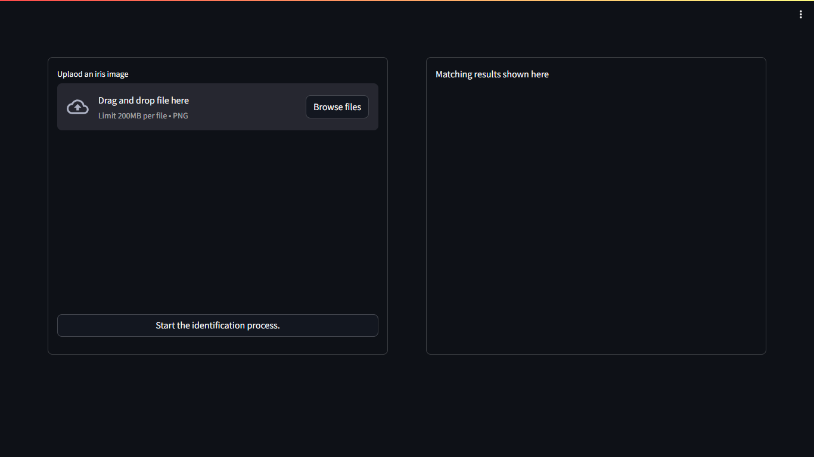
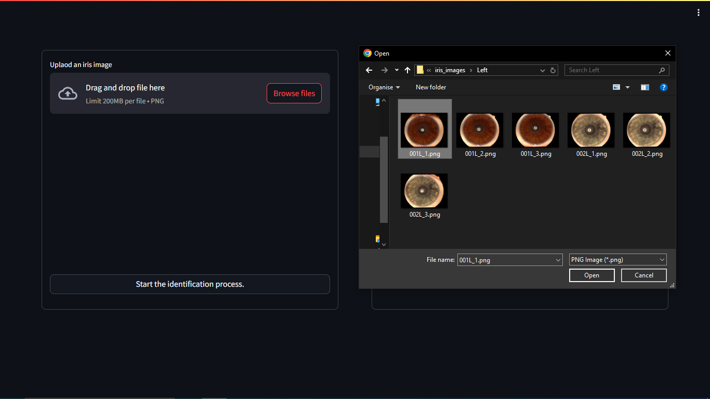
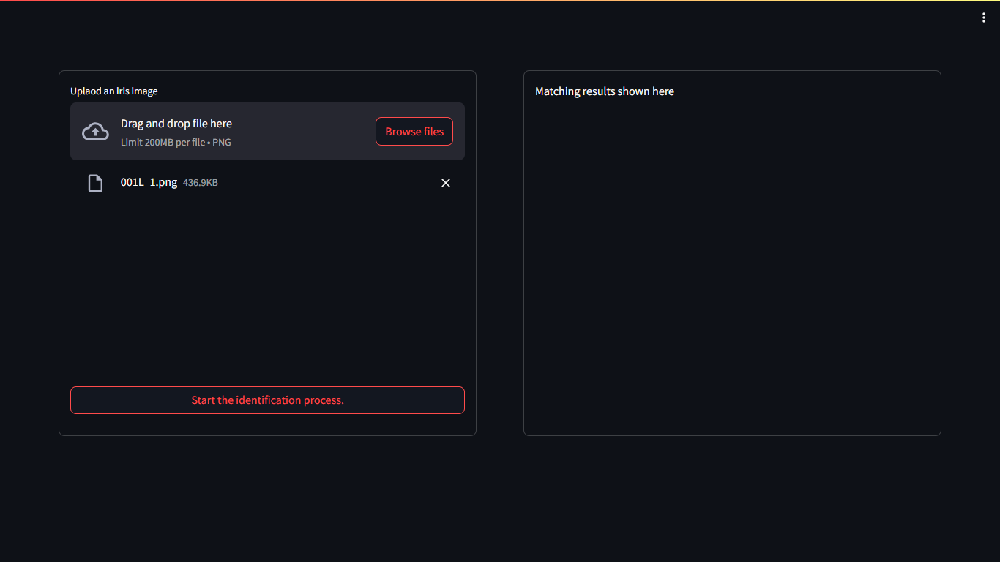
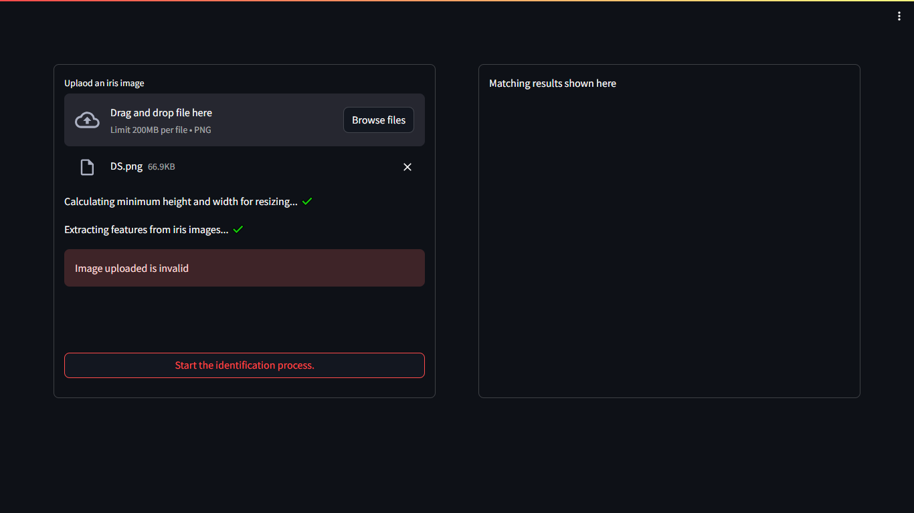
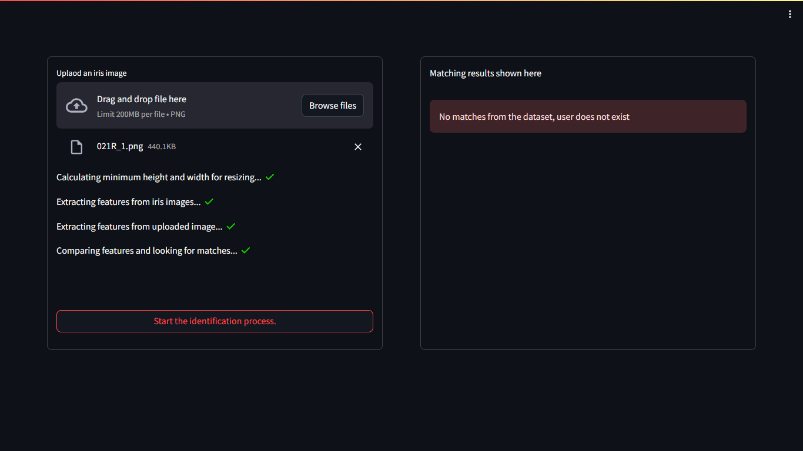
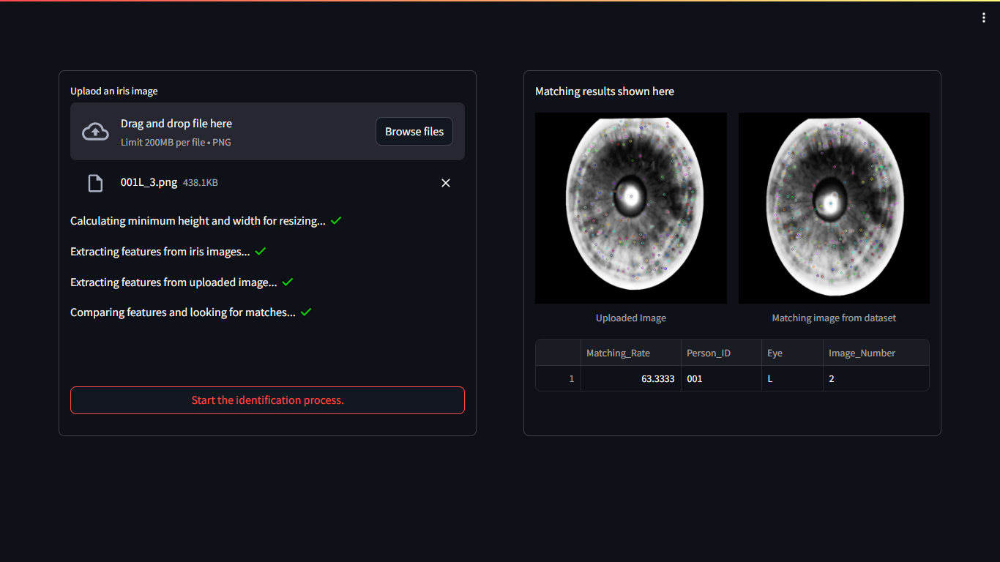

# Machine Learning College Projects

## Overview
This repository contains 4 Machine Learning projects that I have done during my college time. The projects are as follows:
1. [Email Spam Detection](#1-email-spam-detection)
2. [Emotion Classification (Urdu)](#2-emotion-classification-urdu)
3. [Voice Classification](#3-voice-classification)
4. [Iris Recognition](#4-iris-recognition)


## 1. Email Spam Detection
### Description
This project aims to classify emails as either spam or ham (not spam) using machine learning techniques. The dataset used for this project contains labeled emails, and various text processing and machine learning algorithms are applied to build an effective spam detection model.

### Dependencies
The project requires the following dependencies:
- pandas
- numpy
- scikit-learn

You can install these dependencies using the following command:
```sh
pip install pandas numpy scikit-learn
```
### Dataset
The dataset used for this project is the <a href="Email Spam Classification/Homework dataset.csv">Homework dataset</a> from Kaggle. The dataset contains two columns:<br>
`text` - the email content<br>
`label` - the label (spam or ham)<br>
`label_num` - the numerical representation of the label (0 for ham, 1 for spam)

### Data Preprocessing
The dataset is loaded and preprocessed to remove duplicates and handle missing values. The text data is extracted and labeled for further processing.

### Feature Extraction
Various feature extraction techniques are used to convert text data into numerical representations:

- CountVectorizer with different n-gram ranges
- Character-level analysis
- TF-IDF Vectorizer

### Model Training
Several machine learning models are trained and evaluated using GridSearchCV to find the best hyperparameters:

- Support Vector Machine (SVM)
- Multinomial Naive Bayes
- Random Forest
- K-Nearest Neighbors (KNN)

### Evaluation
The best model is selected based on the evaluation metrics, and its performance is reported using precision, recall, and F1-score.

## 2. Emotion Classification (Urdu)
### Description
This project aims to classify emotions in Urdu speech using machine learning techniques. The dataset used for this project contains labeled audio files, and various audio processing and machine learning algorithms are applied to build an effective emotion detection model.

### Dependencies
The project requires the following dependencies:
- pandas
- numpy
- scikit-learn
- librosa
- matplotlib
- seaborn

You can install these dependencies using the following command:
```sh
pip install pandas numpy scikit-learn librosa matplotlib seaborn
```
### Dataset
The dataset used for this project is available on <b>Kaggle</b>. The dataset contains audio files labeled with different emotions in Urdu.<br>
<a href="https://www.kaggle.com/datasets/anisguechtouli/urdu-ml-dataset/data">Dataset link</a>

### Data Preprocessing
The dataset is loaded and preprocessed to split the data into training and test sets. The audio files are organized into respective directories for further processing.

### Feature Extraction
Various feature extraction techniques are used to convert audio data into numerical representations:
- MFCCs (Mel-frequency cepstral coefficients)
- Mel-frequency spectrogram

### Model Training
Several machine learning models are trained and evaluated using different random states and hyperparameters:
- Support Vector Machine (SVM)
- Multi-layer Perceptron (MLP)
- K-Nearest Neighbors (KNN)

### Model Evaluation
The best model is selected based on the evaluation metrics, and its performance is reported using precision, recall, and F1-score.

## 3. Voice Classification
### Description
This project aims to classify different types of voices using machine learning techniques. The dataset used for this project contains labeled audio files, and various audio processing and machine learning algorithms are applied to build an effective voice classification model.

### Dependencies
The project requires the following dependencies:
- numpy
- pandas
- matplotlib
- seaborn
- librosa
- scikit-learn

You can install these dependencies using the following command:
```sh
pip install numpy pandas matplotlib seaborn librosa scikit-learn
```
### Dataset
The dataset used for this project is available on <b>Kaggle</b>. The dataset contains audio files labeled with different types of voices.<br>
<a href="https://www.kaggle.com/datasets/anisguechtouli/tp-ml2-audio/data">Dataset link</a>

### Feature Extraction
Various feature extraction techniques are used to convert audio data into numerical representations:
- MFCCs (Mel-frequency cepstral coefficients)
- Mel-frequency spectrogram
- Chroma features
- Spectral contrast
- Tonnetz

### Model Training
Several machine learning models are trained and evaluated using different random states and hyperparameters:
- Support Vector Machine (SVM)
- Multi-layer Perceptron (MLP)
- K-Nearest
- Random Forest
- Multinomial Naive Bayes

### Model Evaluation
The best model is selected based on the evaluation metrics, and its performance is reported using precision, recall, and F1-score.

### Jupyter Notebook
The implementation of the voice classification project is available in the Jupyter notebook: <a href="Voice Classification for Different Voices/Voice classification.ipynb">Voice classification.ipynb</a>

## 4. Iris Recognition



### Description
This project focuses on iris recognition using machine learning techniques. The goal is to accurately identify individuals based on their iris patterns.

### Dependencies
- numpy
- pandas
- os
- cv2
- matplotlib

### Dataset
The dataset used for this project can be found on Kaggle: [Iris Recognition Dataset](https://www.kaggle.com/datasets/anisguechtouli/extraction)

### Feature Extraction
The following features are extracted from the iris images:
- Mean
- Standard Deviation
- Skewness
- Kurtosis
- Entropy

### Model Training
Several machine learning models are trained and evaluated using different random states and hyperparameters:
- Support Vector Machine (SVM)
- Multi-layer Perceptron (MLP)
- K-Nearest Neighbors (KNN)
- Random Forest
- Multinomial Naive Bayes

### Usage Example
1. Click on "Browse files" to upload an image of an iris.




2. After uploading the image click on "Start the identification process", the model will predict whether the image is of an iris or not.

If the image is not of an iris, it will display "Image uploaded is invalid".


3. If the image is of an iris, the model will search the database for a match and display the result.

4. If no match is found, it will display "No matches from the dataset, user does not exist".



5. If a match is found, it will display the user ID and the image of the matched iris.



### Model Evaluation
The best model is selected based on the evaluation metrics, and its performance is reported using precision, recall, and F1-score.

### Jupyter Notebook
The implementation of the iris recognition project is available in the Jupyter notebook: [ei-notebook.ipynb](iris_recognition/ei-notebook.ipynb)

## Conclusion
These projects demonstrate the application of machine learning techniques to solve real-world problems. The projects cover a wide range of topics, including text classification, audio processing, and biometric recognition. By working on these projects, I have gained valuable experience in data preprocessing, feature extraction, model training, and evaluation. I hope these projects inspire you to explore the exciting field of machine learning and develop your own innovative solutions.

## Note about the authors
These were group projects, and the authors are mentioned in each project's respective notebook.